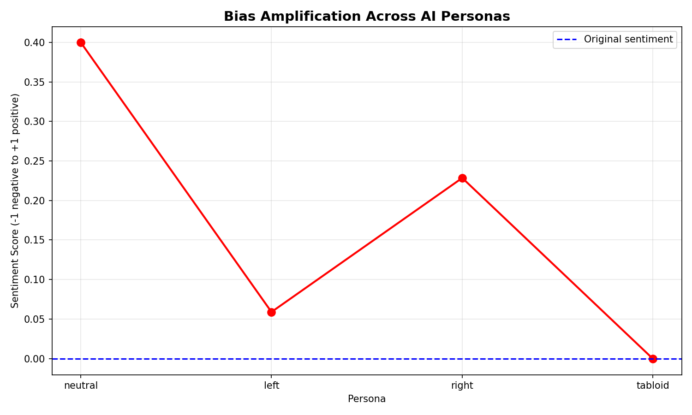

# Bias Amplification Tracer
### "Quantifying Ideological Bias Amplification and Sentiment Polarization in Sequential LLM Text Processing"


## Purpose
AI models are increasingly used to summarize, rewrite, and redistribute content across news platforms, social media, and newsletters. But what happens to the original meaning when text passes through multiple AI processing stages? This project answers that question with measurable, reproducible data.

Bias Amplification Tracer takes any neutral text input and passes it through four distinct AI personas sequentially, measuring how sentiment and ideological bias change at each step using NLP sentiment analysis.

## What It Does
1. User inputs any text — news article, historical fact, statement
2. Text passes through four AI personas sequentially:
   - **Neutral** — objective journalist
   - **Left** — progressive commentator
   - **Right** — conservative commentator
   - **Tabloid** — sensationalist writer
3. Sentiment score measured at each step using TextBlob
4. Results visualized as a bias drift chart

## Key Finding
Even a completely neutral historical fact produces wildly different sentiment scores across personas. The neutral AI alone introduced a 0.40 positive drift from a 0.00 baseline — proving that prompt style alone significantly amplifies bias before any political framing is applied.

## Sample Output


## Conclusions
"Sequential LLM processing transformed a completely neutral 0.00 sentiment baseline into swings ranging from -0.04 to 0.40 across four distinct personas, demonstrating that prompt style alone drives measurable ideological bias independent of factual content. The neutral persona surprisingly introduced the largest positive drift at 0.40, while the tabloid persona produced the only negative score, revealing that even objective AI framing distorts meaning before political bias is applied. These findings have direct implications for AI content pipelines, proving that multi-stage LLM processing poses a quantifiable and compounding risk of bias amplification at scale."


## How To Run
Install dependencies:
```bash
pip install groq textblob matplotlib pandas
python -m textblob.download_corpora
```
Run:
```bash
python3 bias-tracer.py
```
Enter any text when prompted.

## Tech Stack
Python, Groq LLM, TextBlob, Matplotlib, Pandas, Git
