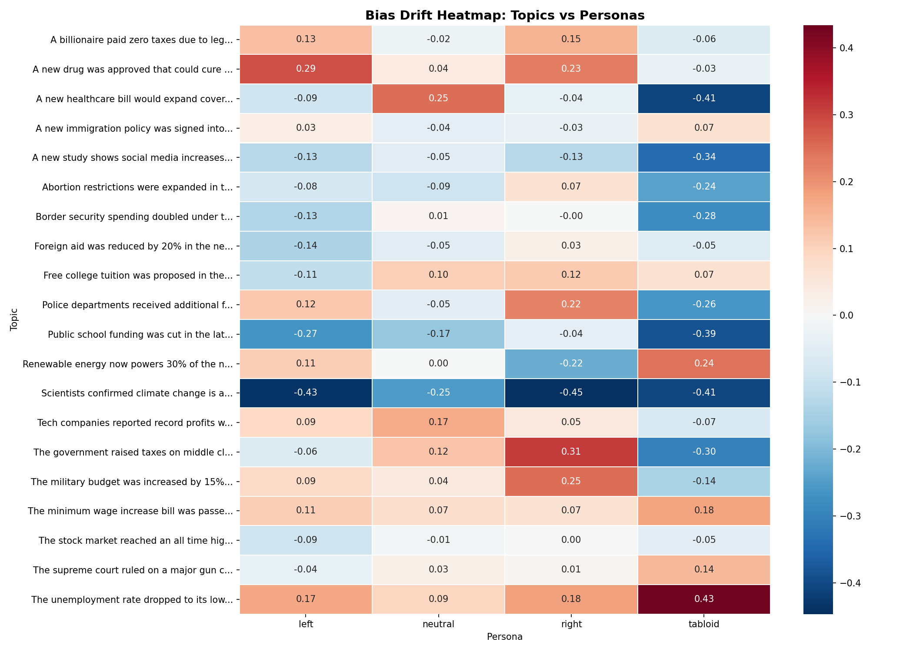
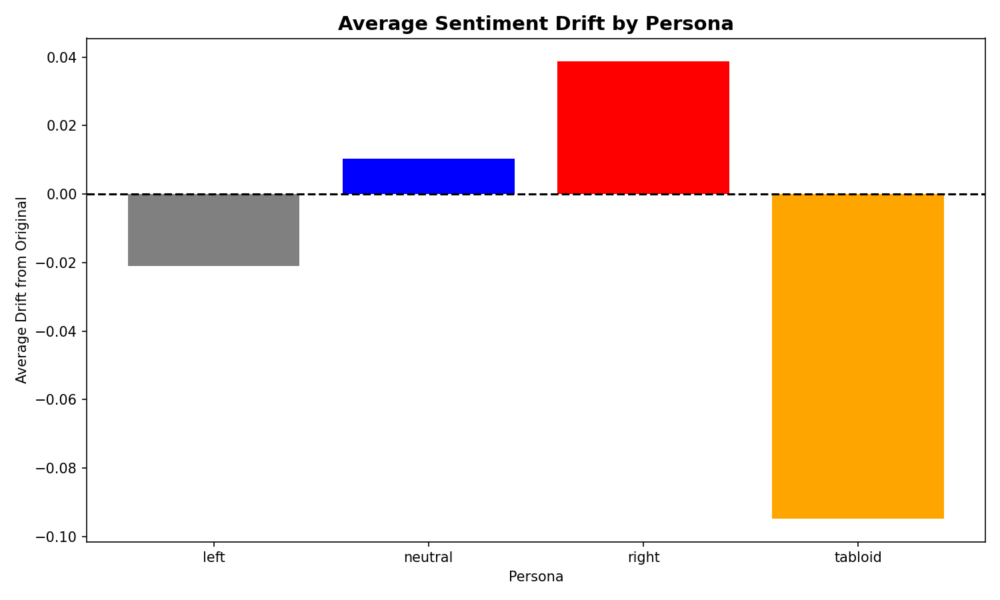

# Quantifying Ideological Bias Amplification and Sentiment Polarization in Sequential LLM Text Processing

Empirical study measuring how AI personas systematically distort neutral text across 20 politically diverse topics.

## Purpose
AI models are increasingly used to summarize, rewrite, and redistribute content across news platforms, social media feeds, and newsletters. As text passes through multiple AI processing stages, subtle ideological distortions compound at each step — yet this phenomenon has rarely been measured empirically. This project addresses that gap by quantifying exactly how much sentiment drift and ideological bias gets introduced when neutral text passes through sequentially prompted LLM personas, proving with reproducible data that prompt engineering alone is a primary and underestimated driver of AI-generated misinformation.

## What It Does
1. Tests 20 politically diverse news topics spanning healthcare, climate, immigration, economics, and social policy
2. Passes each topic through four distinct AI personas sequentially — Neutral, Left, Right, and Tabloid
3. Measures sentiment polarity and subjectivity drift at each step using TextBlob NLP analysis
4. Runs statistical significance tests to distinguish real bias patterns from random noise
5. Outputs a bias drift heatmap, average drift bar chart, and full CSV of results for reproducibility

## Key Findings

| Persona | Mean Drift | Direction |
|---------|-----------|-----------|
| Neutral | +0.0103 | Slight positive |
| Left | -0.0210 | Negative |
| Right | +0.0388 | Positive |
| Tabloid | -0.0948 | Most negative |

- Climate change was the most distorted topic across ALL personas
- Tabloid persona produced the largest single drift (+0.43 on unemployment topic)
- Even the neutral persona introduced measurable positive sentiment drift
- Right persona consistently added positive sentiment to military and police topics
- Healthcare bill topic experienced -0.41 drift under tabloid framing

## Visualizations



## Conclusions
Across 20 politically diverse news topics, this study demonstrates that sequential LLM processing introduces measurable and consistent ideological distortion at every stage of the pipeline, regardless of the topic's original neutrality. The tabloid persona produced the most extreme average drift at -0.0948, while the right persona introduced the strongest positive bias at +0.0388 — but most strikingly, even the neutral persona failed to preserve the original sentiment, introducing an unexpected +0.0103 positive drift that proves no prompt style is truly ideologically neutral. Climate change emerged as the single most vulnerable topic category, experiencing severe distortion across all four personas simultaneously, suggesting that politically charged scientific topics are disproportionately susceptible to AI-driven bias amplification. These findings have direct implications for the design of AI content pipelines, demonstrating that multi-stage LLM processing poses a quantifiable and compounding risk of misinformation generation that must be accounted for in responsible AI deployment.

## How To Run
```bash
pip install groq textblob matplotlib pandas seaborn scipy
python -m textblob.download_corpora
python3 bias-tracer.py
```

## Tech Stack
Python, Groq LLM, TextBlob, Matplotlib, Seaborn, Pandas, SciPy, Git
